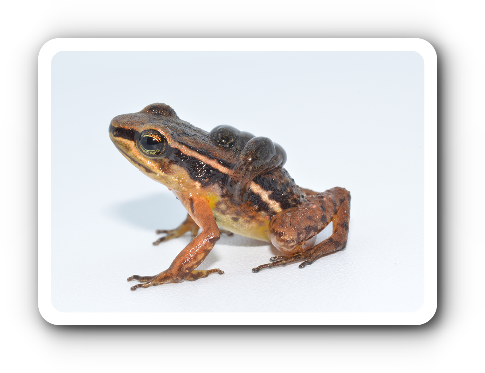
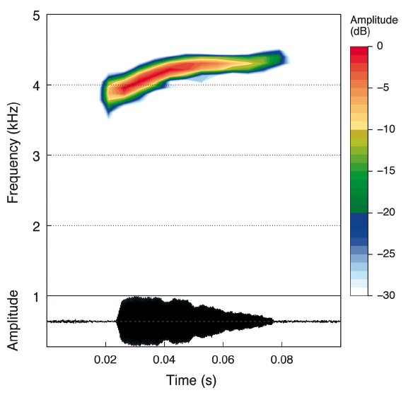

    

Los audios y tablas corresponden a la publicación: 
<strong>Marín, C.M., C. Molina-Zuluaga, A. Restrepo, E.Cano & J.M. Daza.</strong> 2018. A new species of <i>Leucostethus</i> (Anura: Dendrobatidae) from the eastern versant of the Central Cordillera of Colombia with comments on the phylogenetic position of <i>Colostethus fraterdanieli</i>. <i>Zootaxa</i> 4461: 359--380. <a href="https://doi.org/10.11646/zootaxa.4461.3.3">https://doi.org/10.11646/zootaxa.4461.3.3</a>

<!-- Seccion espectrograma -->

  <video width="100%" height="auto" controls style="display: block; margin-left: auto; margin-right: auto;">
    <source src="Espectrograms/Leucostethus_fraterdanieli.mp4" type="video/mp4">
    Tu navegador no soporta el elemento de video.
  </video>
    
  

<!-- Seccion de tablas -->
<a href="https://bit.ly/3LUkN5s">Tablas de medidas </a> 
<a href="https://bit.ly/3LUkN5s">Tablas selección RAVEN</a>
 

<!-- Seccion de audios -->
<a href="https://bit.ly/3LUkN5s">Archivos de audio</a>  

Contribución por: <a href="mailto:marinc.carlosmario@gmail.com">Carlos M. Marin</a>, <a href="mailto:juanm.daza@udea.edu.co">Juan M. Daza</a>

