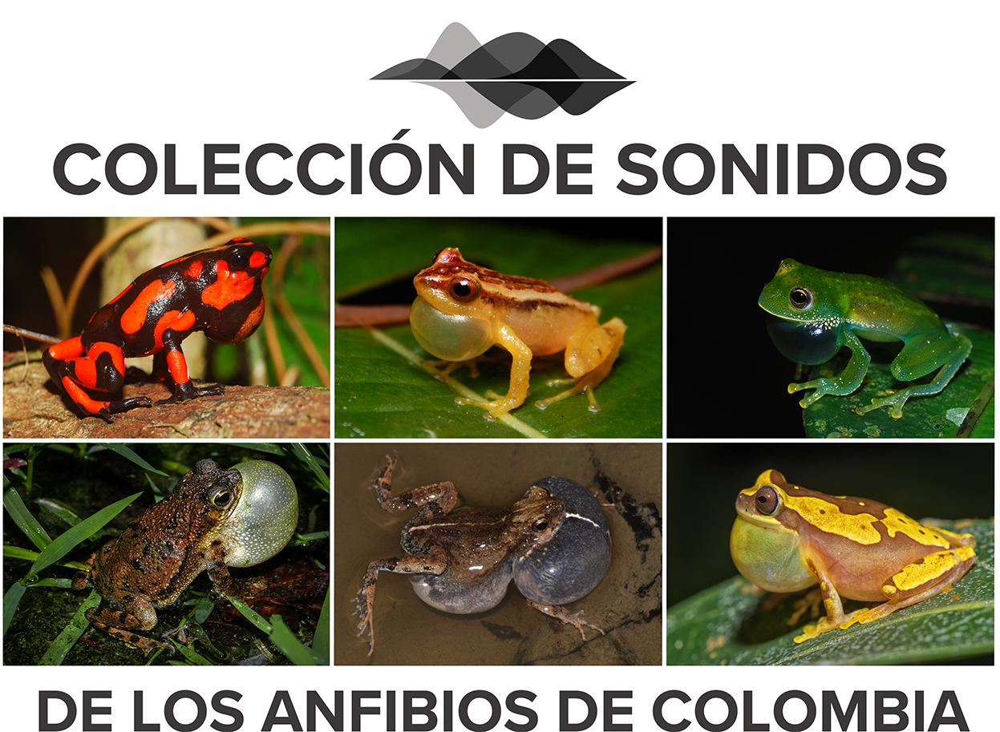

    

 

Colombia tiene una gran diversidad de anfibios y sus sonidos, muchos de los cuales se encuentran sin describir. Sin embargo, la gran mayoria de poblaciones o especies no cuentan con una descripcion formal de sus vocalizaciones (Rivera et al XXXX). Adicionalmente, pocas cuentan con datos disponibles en repositorios de libre acceso. Aunque algunos de estos repositorios tienen políticas de uso, son de difícil acceso. Finalmente, en bioacústica de anuros, se asume que la reproducibilidad de los datos esta solo en disponibilizar los audios. Sin embargo, es recomendable disponibilizar las tablas crudas de los datos sobre las cuales las descripciones fueron hechas. Esta disponibilizacion no solo permite reproducibilidad y transparencia cientifica sino que además agregan mucho mas valor a los datos mismos dado que pueden ser reutilizados con multiples propósitos.

Este repositorio permite visibilizar y disponibilizar los datos asociados a los cantos de anuncio publicados de especies en Colombia. Los datos corresponden a los audios, las medidas realizadas por los investigadores y las tablas de selección generadas en el programa [Raven](https://store.birds.cornell.edu/collections/raven-sound-software).

Nuestra motivación son los [principios FAIR](https://www.go-fair.org/fair-principles/) donde se busca en ciencia abierta hacer los datos digitales (e.g., archivos de sonido) facilmente reutilizables por la comunidad científica y general. Asi, este sitio se convierte en el primer repositorio en Colombia donde integra de una forma simple y eficiente la información relacionada con datos acústicos obtenidos para la anurofauna del país.

Este repositorio busca:

1.  La reproducibilidad de los resultados obtenidos en descripciones de cantos.

2.  Facilitar nuevas descripciones de cantos y estudios comparativos.

3.  Facilitar archivos anotados para el entrenamiento de algoritmos de detección automática de especies.

4.  Apoyar cursos y prácticas en Bioacústica y Ecoacústica.

## Política de uso
Los datos en este repositorio han sido contribuidos por los autores, con el objetivo de hacer la ciencia más abierta y transparente. Así, el uso de los datos obtenidos aquí es abierto, con fines académicos y científicos, y estan bajo la licencia de [Creative Commons](https://co.creativecommons.net/tipos-de-licencias/) no comercial.
  

## Como contribuir?
Este proyecto funciona de forma similar a una colección herpetológica de ejemplares, donde el autor somete los datos relacionados a su estudio [acústico] (e.g., audios, tablas, links) para poder ser visualizados y disponibles a la comunidad académica.

Si estas interesado y tienes mas preguntas <a href="mailto:sonidoscolombia@gmail.com">contáctanos</a>
 
## Especies incluidas en este repositorio

# Dendrobatidae
- [Andinobates cassidyhornae](Andinobates_cassidyhornae.md)
- [Leucostethus fraterdanieli simple](Leucostethus_fraterdanieli_simple.md)
- [Leucostethus fraterdanieli](Leucostethus_fraterdanieli.md)
- [Leucostethus jota](Leucostethus_jota.md)

# Eleutherodactylidae
- [Diasporus anthrax](Diasporus_anthrax.md)

# Hylidae

- [Dendropsophus norandinus](Dendropsophus_norandinus.md)
- [Hyloscirtus antioquia](Hyloscirtus_antioquia_.md)

# Strabomantidae

- [Pristimantis campesino](Pristimantis.md)
- [Pristimantis cryptopictus](Pristimantis.md)
- [Pristimantis dorsopictus](Pristimantis.md)
- [Pristimantis jaguensis](Pristimantis.md)
- [Pristimantis viejas](Pristimantis.md)
- [Pristimantis zorro](Pristimantis.md)

## Distribución geográfica de registros en repositorios
Aquí se puede visualizar y acceder a los sonidos de tres diferentes repositorios: 

1. Colección de sonidos alojados en este repositorio (ver arriba) donde se recopilan los audios asociados a publicaciones científicas.
2. La [colección de Sonidos Ambientales](http://colecciones.humboldt.org.co/sonidos/) del Instituto Alexander von Humboldt que incluye audios y tablas de selección. Si se requieren mas metadatos, se debe contactar al repositorio. 
3. Registros de la plataforma [iNaturalist](https://www.inaturalist.org/projects/amphibians-and-reptiles-of-colombia) donde se incluyen sonidos.

Es importante resaltar que la incertidumbre taxonomica de los cantos aqui visualizados es inherente a cada repositorio y se sugiere entonces que el usuario debe escoger que cantos utilizar para cada fin en particular.

<iframe src="https://www.google.com/maps/d/u/1/embed?mid=14vULshF6ww3Tvdzq5kJU_vYbgYpHZM0&ehbc=2E312F&noprof=1" width="640" height="480"></iframe>

## Comunidad
Diseño y mantenimiento: 
<a href="mailto:juanm.daza@udea.edu.co">Juan M. Daza</a>, Grupo Herpetológico de Antioquia

Programación: 
<a href="mailto:mariaj.guerrero@udea.edu.co">Maria J. Guerrero</a>, 
<a href="mailto:juanm.daza@udea.edu.co">Juan M. Daza</a>, Grupo Herpetológico de Antioquia

Contribuidores: 
<a href="mailto:mauricio.rivera1@udea.edu.co">Mauricio Rivera</a>, Grupo Herpetológico de Antioquia 
<a href="mailto:marinc.carlosmario@gmail.com">Carlos M. Marin</a>, Inecol, Mexico

## Otros repositorios con especies colombianas

[Colección Sonidos IAVH](http://colecciones.humboldt.org.co/sonidos/) 
[Santander Herpetológico](https://www.santanderherps.com/) 
[Fonozoo](https://www.fonozoo.com/) 
[iNaturalist](https://www.inaturalist.org/projects/amphibians-and-reptiles-of-colombia) 
[Figshare](https://figshare.com/) 
[AmphibiaWeb Ecuador](https://bioweb.bio/faunaweb/amphibiaweb/Cantos/)

## Recursos en Bioacústica
[Bioacoustics Talks](https://www.birds.cornell.edu/ccb/bioacoustalks/)

